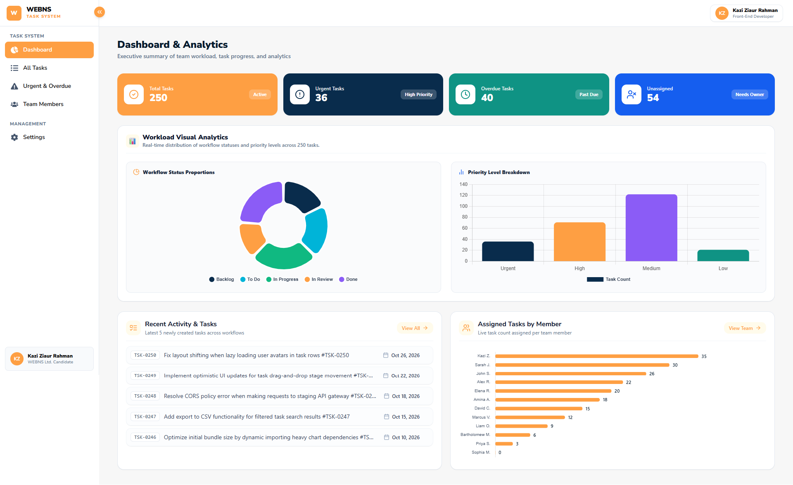
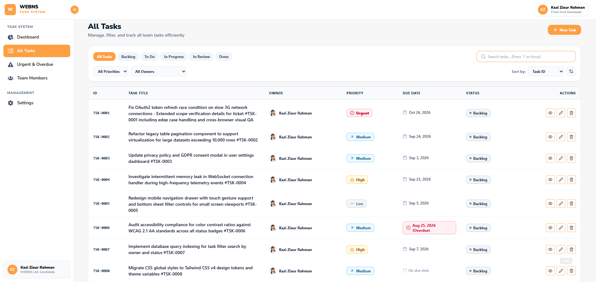

# Relay Task System — Technical Architecture & Evaluation Documentation

A high-performance, responsive, state-driven **Team Workload Task Management Dashboard** built for **WEBNS Technology Ltd.**

🌐 **Live Production Application**: [https://webns-task.netlify.app/](https://webns-task.netlify.app/)

> [!NOTE]
> **Strict Non-Negotiables Compliance**: Built exclusively with **React 19 & TypeScript** (strict mode, zero `any` types) using custom **Tailwind CSS v4** layout architecture. No pre-built component UI kits (MUI, Ant Design, Chakra) were used.

---

## 1. Screenshots & Responsive Viewports

### 💻 Desktop View (1280px Viewport) — Executive Dashboard & Workload Analytics


### 📋 Desktop View (1280px Viewport) — High-Density Workload Table List


### 📊 Tablet View (768px Viewport) — Analytical Dashboard


### 📱 Mobile View (375px Viewport) — Touch-Friendly Task Cards & Mobile Filter Drawer


---

## 🚀 2. Clean Clone & Local Run Instructions

> [!TIP]
> **Live Deployed Application**: Test the live production build directly without local installation at: **[https://webns-task.netlify.app/](https://webns-task.netlify.app/)**

Follow these steps to run the application locally from a clean repository clone:

### Prerequisites
- **Node.js**: `>= 18.0.0`
- **Package Manager**: `pnpm` (`>= 8.0.0`), `npm`, or `yarn`

### Setup Steps
```bash
# 1. Repository Link
https://github.com/kazi-ziaur-rahman-majba/Relay-task-system

# Repository Clone HTTPS Through
git clone https://github.com/kazi-ziaur-rahman-majba/Relay-task-system.git

# Repository Clone SSH Key Through
git clone git@github.com:kazi-ziaur-rahman-majba/Relay-task-system.git

### Option A: Running with Docker (Recommended & Containerized)
```bash
# Build and run containerized app via Docker Compose
docker compose up --build -d
```
Open **[http://localhost:8080](http://localhost:8080)** in your browser.

### Option B: Local Node.js Development
```bash
# 1. Install dependencies
pnpm install

# 2. Start Vite local development server
pnpm dev
```
Open **[http://localhost:5173](http://localhost:5173)** in your browser.

---

## System Architecture & Unidirectional Data Flow

The application follows a strict unidirectional data flow connecting the URL state, LocalStorage persistent data mutators, the deterministic filtering engine, and responsive UI components:

```text
                           public/team-members.json & tasks.json
                                             │
                                             ▼
                                    useTaskStorage Hook
                          (State Mutator + LocalStorage Persistence)
                                             │
                       ┌─────────────────────┴─────────────────────┐
                       ▼                                           ▼
             Task Mutation Handlers                      URL SearchParams Engine
           (Create, Edit, Delete, Quick Update)              (useUrlTaskState Hook)
                       │                                           │
                       └─────────────────────┬─────────────────────┘
                                             ▼
                                    processTasks Engine
                           (filterTasks ➔ sortTasks ➔ paginateTasks)
                                             │
                                             ▼
                                   Responsive UI Views
                        ┌────────────────────┴────────────────────┐
                        ▼                                         ▼
           Desktop High-Density Table                  Mobile Touch Card List
           (>= 768px / md: breakpoint)               (< 768px / md: breakpoint)
```

---

## 📊 Normalized Data Architecture

To eliminate data duplication across hundreds of task records, the architecture separates **Team Members** from **Tasks**:

### 1. Team Member Entity (`public/team-members.json`)
```json
{
  "id": "USR-003",
  "name": "Alex Rivera",
  "email": "alex.rivera@webns.io",
  "avatarUrl": "https://api.dicebear.com/7.x/avataaars/svg?seed=Alex"
}
```

### 2. Task Entity (`public/tasks.json`)
```json
{
  "id": "TSK-0001",
  "title": "Fix OAuth2 token refresh race condition on slow 3G network connections",
  "description": "Users on mobile networks are experiencing silent authentication failures...",
  "status": "backlog",
  "priority": "urgent",
  "ownerId": "USR-003",
  "dueDate": "2026-09-15T12:00:00.000Z",
  "createdAt": "2026-08-21T12:00:00.000Z",
  "updatedAt": "2026-08-31T12:00:00.000Z"
}
```

### 3. Data Model Rationale & Workflow Stages

#### Included Fields & Purpose
- `id`: Unique identifier (`TSK-XXXX`) for instant lookup.
- `title`: Primary headline description (supports wildly varying lengths).
- `description`: Detailed context, repro steps, or acceptance criteria (optional).
- `status`: Workflow stage (Enum: `backlog`, `todo`, `in_progress`, `in_review`, `done`).
- `priority`: Urgency level (Enum: `urgent`, `high`, `medium`, `low`).
- `ownerId`: Foreign key linking to single team member (`USR-XXX` or `null` for unassigned).
- `dueDate`: ISO date string for tracking overdue / today / future tasks (`null` allowed).
- `createdAt` / `updatedAt`: Timestamps for audit trail and sorting.

#### Fields Deliberately Left Out & Rationale
- **Subtasks & Epics**: Avoided multi-level hierarchy to prevent administrative overhead. An 8–15 person team needs flat, highly scannable tasks, not deep nested ticket trees.
- **Attachments & Media Uploads**: Keeps LocalStorage payload lightweight and avoids storage bloat.
- **Multi-Assignee Support**: Kept a strict single `ownerId` per task to enforce clear accountability ("who owns it").

#### Workflow Stages Rationale (5 Stages)
1. 📥 **Backlog**: Triage area for raw ideas and unscheduled work.
2. 📋 **To Do**: Prioritized items ready for immediate action in the current cycle.
3. ⚡ **In Progress**: Active work currently being executed by an owner.
4. 👀 **In Review**: QA / peer review checkpoint ensuring quality before release.
5. ✅ **Done**: Verified completed tasks archived from active backlog view.

---

## 🔗 Bi-Directional URL SearchParams Synchronization

Every user interaction with search, filters, sorting, and pagination bi-directionally syncs with browser query parameters via `useUrlTaskState()`:

| Query Parameter | Application Mapping | Format & Values |
| :--- | :--- | :--- |
| `?search=` | Text Search | Case-insensitive match on Title, ID (`TSK-XXXX`), or Owner Name |
| `?status=` | Workflow Status | Comma-separated enums: `backlog,todo,in_progress,in_review,done` |
| `?priority=` | Priority Level | Comma-separated enums: `urgent,high,medium,low` |
| `?ownerId=` | Assignee | `unassigned` or specific User ID (`USR-003`) |
| `?sort=` | Sort Field | `dueDate`, `priority`, `createdAt`, or `title` |
| `?order=` | Sort Direction | `asc` or `desc` |
| `?page=` | Page Number | 1-indexed page integer |

### Clean Default Strategy
Default values (`search=""`, `status=all`, `priority=all`, `ownerId=all`, `sort=createdAt`, `order=desc`, `page=1`) leave the URL clean (`/`). Copying or sharing any filtered URL restores the exact state 100% on page load or browser back/forward navigation.

---

## Filtering, Sorting & Pagination Engine

The pure functional pipeline (`src/utils/taskFilterEngine.ts`) decouples state mutations from display logic:

1. **`filterTasks(tasks, filters, usersMap)`**:
   - Performs $O(1)$ lookup mapping `ownerId ➔ User` to match search queries against task title, task ID, or owner name.
2. **`sortTasks(filteredTasks, sortBy, sortOrder)`**:
   - Deterministically sorts tasks. **Null due dates are always sorted last** regardless of ascending or descending order.
3. **`paginateTasks(sortedTasks, page, pageSize = 10)`**:
   - Computes paginated slices. If a user modifies filters or deletes items reducing `totalPages`, the engine automatically redirects to Page 1 or the last valid page.

---

## LocalStorage Persistence Strategy (`useTaskStorage.ts`)

- **Key**: `relay_tasks_data`
- **Hydration Flow**:
  1. Checks `localStorage.getItem('relay_tasks_data')`.
  2. If present and valid, hydrates state from local storage.
  3. If missing or invalid, fetches `/tasks.json` seed data and initializes local storage.
- **Store-Level Enrichment**: The UI modal supplies user input (`title`, `description`, `status`, `priority`, `ownerId`, `dueDate`). The store internally generates `id` (safe auto-increment `TSK-XXXX`), `createdAt`, `updatedAt`, and `tags`.

---

## Interaction States & System Resilience

Aligned with the strict assessment criteria, the UI cleanly differentiates between 3 distinct system states:

1. **Loading State**: Displays high-fidelity animated `TableSkeleton` rows to prevent Cumulative Layout Shift (CLS) during initial hydration.
2. **Empty State**: Displays contextual "No tasks found" messaging with an explicit **Reset All Filters** action button when filters match 0 results.
3. **Explicit Error State with Retry**:
   - **Hook-Level Error Capture (`useTaskStorage.ts`)**: If JSON seed fetching (`/tasks.json`) or LocalStorage parsing fails, the store catches the exception, updates `error` state, and exposes a memoized `retry` (re-hydration) function.
   - **Component-Level Error Capture (`TasksPage.tsx`)**: Tracks `ownersError` when fetching team members (`/team-members.json`).
   - **UI Presentation**: Instead of showing generic spinners or broken layouts, the app renders a dedicated **Rose-Red Error Alert Card** featuring an `AlertTriangle` icon, explicit error message, and a **"🔄 Retry Loading"** action button that re-triggers dataset hydration seamlessly without a full page reload.

```typescript
// Error State Handling Mechanism in TasksPage.tsx
{isLoading ? (
  <TableSkeleton rowsCount={8} />
) : (storageError || ownersError) ? (
  <div className="p-10 text-center bg-rose-50/60 rounded-2xl border border-rose-200 space-y-4">
    <AlertTriangle className="w-6 h-6 text-rose-600 mx-auto" />
    <h3 className="text-base font-extrabold">Failed to Load Task Data</h3>
    <p className="text-xs text-slate-600">{storageError || ownersError}</p>
    <button onClick={() => { retryStorage(); loadTeamMembers(); }}>
      <RotateCcw className="w-4 h-4" /> Retry Loading
    </button>
  </div>
) : ...}
```

---

## Accessibility Practices Aligned with WCAG 2.1 AA

- **Keyboard Shortcuts**: Pressing `/` focuses the search bar (guarded against active input elements). Pressing `?` opens shortcuts modal. Pressing `Escape` closes active modal dialogs.
- **Modal Focus Management**: Modals feature ARIA tags (`role="dialog"`, `aria-modal="true"`, `aria-labelledby`), auto-focusing on the first input upon launch.
- **Visual Accessibility**: Statuses and priorities pair text badges with high-contrast background and border colors, ensuring color-blind usability.

---

## What We Decided NOT to Build & Why

1. **Kanban Drag-and-Drop Board View**:
   - *Rationale*: Multi-column kanban boards break down on mobile viewports (375px) where columns get squished or force dual-axis scrolling. A high-density table (desktop) transitioning to responsive touch cards (mobile) provides far superior scannability and speed for scanning 250+ tasks.
2. **Bulk Multi-Select Operations**:
   - *Rationale*: Added unnecessary UI complexity and increased risk of destructive bulk edits for a tight 8–15 person team. Single quick-action status updates inside cards/tables provide sufficient efficiency.
3. **Rich-Text Markdown Editor in Description**:
   - *Rationale*: Plain-text descriptions prevent messy inline HTML formatting, ensuring consistent scannability and line clamping across table rows.

---

## Decisions Least Confident About & Alternatives

1. **Client-Side Filtering/LocalStorage vs. Real PostgreSQL Backend**:
   - *Current Decision*: Built as a pure client-side React app with seed JSON and LocalStorage persistence.
   - *Trade-off*: Zero infrastructure overhead and instant setup, but lacks real-time multi-user syncing across team members' devices.
   - *Alternative*: Provisioning a PostgreSQL database with an Express REST API & WebSockets for live multi-user sync (bonus points area).
2. **Table-to-Card Layout Switch on Mobile (`md:` breakpoint)**:
   - *Current Decision*: Replacing table rows with full-width stacked cards below 768px.
   - *Trade-off*: Sacrifices horizontal columnar alignment, but completely eliminates frustrating horizontal table scrollbars on mobile thumbs.
   - *Alternative*: Fixed horizontal scrolling table with frozen sticky left columns.
3. **Strict Single Assignee (`ownerId`) constraint**:
   - *Current Decision*: Each task can only have one owner or be unassigned.
   - *Trade-off*: Prevents ambiguity, but doesn't model shared pair-programming tasks well.
   - *Alternative*: Allowing an array of `coOwners[]` while maintaining one `primaryOwnerId`.

---

## AI Tooling Disclosure & Usage

In accordance with the assignment brief, AI assistance (Google Antigravity / Claude) was utilized during development for:
1. **Boilerplate & Type Generation**: Generating strict TypeScript interfaces for normalized `Task` and `TaskOwner` entities.
2. **Mock Dataset Generation**: Generating 250+ realistic tasks in `public/tasks.json` with edge cases (wildly varying title lengths, missing dates/owners, overdue dates, and inconveniently long names like *Bartholomew Montgomery-Wellington III*).
3. **Responsive CSS Architecture & Accessibility Verification**: Streamlining Tailwind CSS v4 styling rules for touch targets ($\ge 44\text{px}$) and verifying WCAG contrast guidelines.

*Note: All code structure, URL search parameter synchronization, data flow hooks, error state with retry handlers, and component partitioning were designed, reviewed, and fully understood for live walkthrough modifications.*

---
